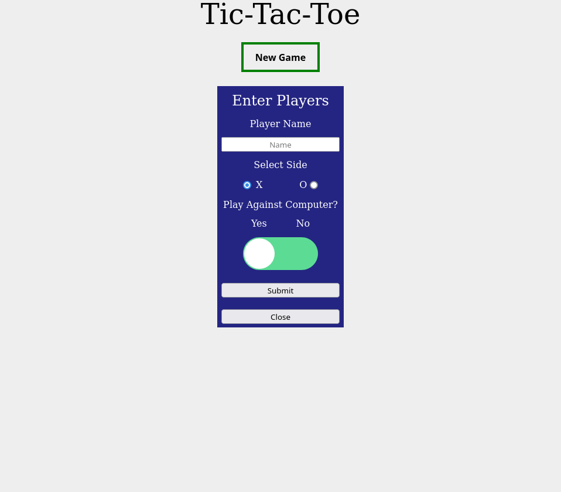
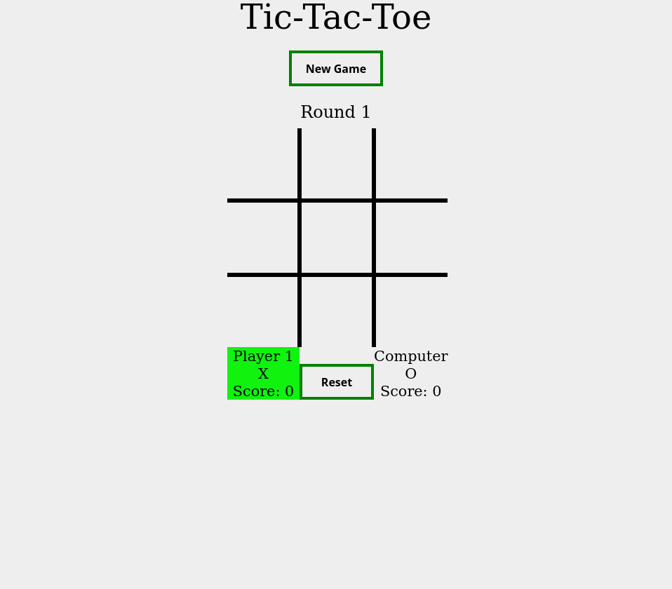
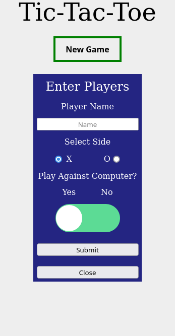
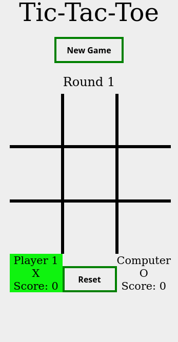

# The Odin Project - Tic-Tac-Toe Project

This is a Project for the game [Tic-Tac-Toe](https://www.theodinproject.com/paths/full-stack-javascript/courses/javascript/lessons/tic-tac-toe). The Odin Project uses this project to help Learn Modular JS and use as little global code as possible.

## Table of contents

- [Overview](#overview)
  - [The challenge](#the-challenge)
  - [Screenshot](#screenshot)
  - [Links](#links)
- [My process](#my-process)
  - [Built with](#built-with)
  - [What I learned](#what-i-learned)
  - [Continued development](#continued-development)
  - [Useful resources](#useful-resources)
- [Author](#author)
- [Acknowledgments](#acknowledgments)


## Overview

### The challenge


- Create a Tic-Tac-Toe Game using using modular JS and has little global code as possible.
- I also Challenged myself to implement the Minimax Algorithm to make and unbeatable Computer.

### Screenshot

- Desktop Solution - New Game Button



- Board



- Mobile Solution - New Game Button



- Board



### Links

- Solution URL: [Live](https://jehutymsms.github.io/Project-Tic-Tac-Toe/)

## My process

### Built with

- Modular JS
- Minimax Algorithm
- Semantic HTML5 markup
- CSS custom properties
- Flexbox
- CSS Grid
- Mobile-first workflow

### What I learned

For this project I did not focus much on the looks of it but more on the overall functionality. 

I first learned about Factory Functions and Module Patters from [this](https://www.theodinproject.com/paths/full-stack-javascript/courses/javascript/lessons/factory-functions-and-the-module-pattern) Odin Project lesson. When I first learned about this it was very interesting and seemed to be a really good way to write code. It made my code look very organized and readable. 

 - One Example of this artitechture is this:

 ```js
const cacheDom = (() => {
            let popupForm = document.getElementById('popupForm'),
            playArea = document.getElementById('play-area'),
            roundwinnerDisplay = document.getElementById('round-winnerDisplay'),
            player1Name = document.getElementById('player1Name'),
            player1Selection = document.getElementById('player1Selection'),
            player1Score = document.getElementById('player1Score'),
            player2Name = document.getElementById('player2Name'),
            player2Selection = document.getElementById('player2Selection'),
            player2Score = document.getElementById('player2Score')

            return{popupForm:popupForm,playArea:playArea,
                roundwinnerDisplay:roundwinnerDisplay,player1Name:player1Name,player1Selection:player1Selection,player1Score:player1Score,player2Name:player2Name,player2Selection:player2Selection,player2Score:player2Score} 
        })()
```
 - So instead of having to Get specific Elements during function calls all of it is done right at the beginning so all that has to be done is simply get those elements from that module.

 - This:
  ```js
const displayBoard = () => {
                cacheDom.playArea.style.display = "grid";
                cacheDom.roundwinnerDisplay.style.display = "block";
            }
```
 - Instead of this:
  ```js
const displayBoard = () => {
                document.getElementById('play-area').style.display = "grid";
                document.getElementById('round-winnerDisplay').style.display = "block";
            }
```


 - The one thing I am most proud of in this Project is the Minimax Algorithm I implemented for the computer. 

 - These Resources were IMMEASURABLY helpful in getting down the concept and psuedo code for it:

 - [Algorithms Explained – minimax and alpha-beta pruning](https://www.youtube.com/watch?v=l-hh51ncgDI&ab_channel=SebastianLague)

 - [How to make your Tic Tac Toe game unbeatable by using the minimax algorithm](https://www.freecodecamp.org/news/how-to-make-your-tic-tac-toe-game-unbeatable-by-using-the-minimax-algorithm-9d690bad4b37/)


### Continued development

In the future I want to learn more about algotihms and implement modular JS on more projects.

### Useful resources

- [Coding Train minimax Algorithm ](https://thecodingtrain.com/CodingChallenges/154-tic-tac-toe-minimax.html) - Tic Tac Toe AI with Minimax Algorithm
-[Algorithms Explained – minimax and alpha-beta pruning ](https://www.youtube.com/watch?v=l-hh51ncgDI&ab_channel=SebastianLague)- Minimax Algorithm Concept
 - [freecodecamp.org ](https://www.freecodecamp.org/news/how-to-make-your-tic-tac-toe-game-unbeatable-by-using-the-minimax-algorithm-9d690bad4b37/)- Minimax Algorithm Explanation Document.
- [Flexbox Resource ](https://css-tricks.com/snippets/css/a-guide-to-flexbox/#background) - This helped me for Flexbox and has amazing visuals.
- [Grid Resource ](https://css-tricks.com/snippets/css/complete-guide-grid/) - This helped me for Grid and has amazing visuals.

## Author

- Portfolio - [Andrew Humphries](https://jehutymsms.github.io/portfolio/)


## Acknowledgments

I would like to thank Odin Project for setting me on this path and giving me the confidence to try this project. 
